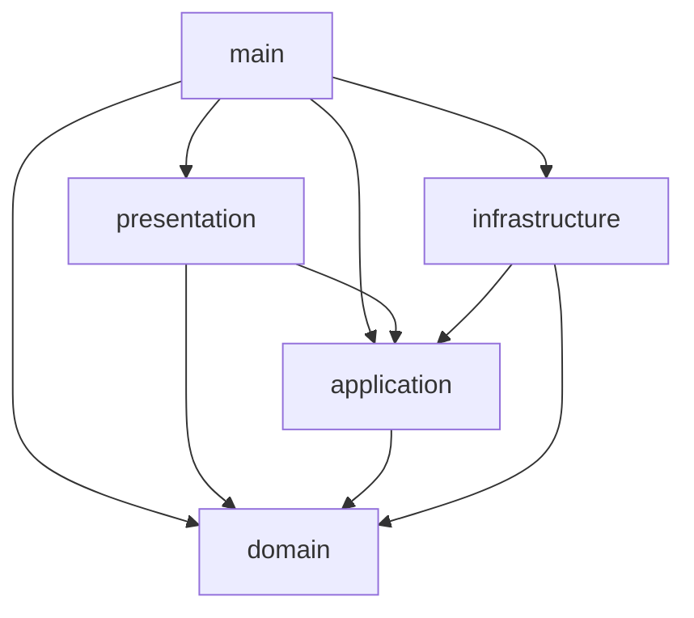
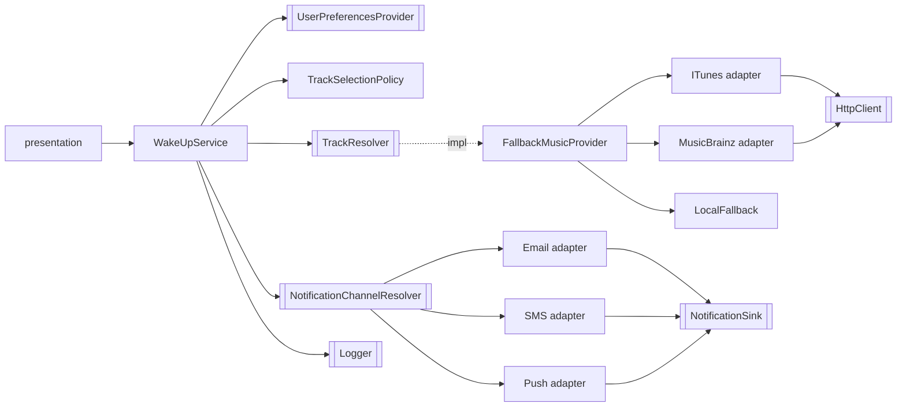

# Architecture Spine — Réveil musical

## Design Paradigm

Hexagonal : le métier au centre, des ports (interfaces) définis par `domain`/`application`, des adapters dans `infrastructure`. Un seul fichier connaît tout : `src/main/container.ts`.

| Couche | Répertoire | Contenu |
| --- | --- | --- |
| Présentation | `src/presentation` | parsing/validation des entrées, mapping `SOLEIL→SUNNY` |
| Application | `src/application` | `WakeUpService`, politiques, `FallbackMusicProvider`, tokens applicatifs |
| Domaine | `src/domain` | modèles purs, ports + tokens, erreurs |
| Infrastructure | `src/infrastructure` | adapters, DTO tiers privés, résilience, config |
| Composition root | `src/main` | `container.ts`, `index.ts` |

## Invariants & Rules



### AD-1 — Sens des dépendances [ADOPTED]

- **Binds:** all
- **Prevents:** fuite d'un détail technique vers le métier ; cycles.
- **Rule:** les imports suivent le schéma ci-dessus et rien d'autre. `domain` n'importe aucun package tiers ni `tsyringe`. `application` n'importe de tiers que les décorateurs `tsyringe`. `presentation` n'importe pas `infrastructure`. Aucun cycle. Vérifié par `dependency-cruiser` et `tests/architecture`.

### AD-2 — Un port par besoin métier, token `Symbol` voisin

- **Binds:** CAP-2, CAP-4, CAP-5
- **Prevents:** ports calqués sur une API tierce ; deux nommages du même besoin.
- **Rule:** chaque port vit dans `src/domain/ports/<Port>.ts` avec son token `<UPPER_SNAKE>` exporté à côté. Nom métier (`MusicProvider.find`, jamais `searchITunes`). Les tokens purement applicatifs sont dans `src/application/tokens.ts`.

### AD-3 — Injection par constructeur, `@inject(TOKEN)` partout [ADOPTED]

- **Binds:** all
- **Prevents:** dépendance à `emitDecoratorMetadata` ; `new` dispersé ; service locator.
- **Rule:** chaque paramètre de constructeur porte `@inject(TOKEN)`, est `private readonly`, typé par interface ; 5 paramètres maximum. `new` d'implémentation, `container.resolve`/`resolveAll` et `import 'reflect-metadata'` n'existent que dans `src/main` (et le setup de test).

### AD-4 — Durées de vie déclarées dans `container.ts` uniquement

- **Binds:** CAP-4, CAP-5, CAP-6
- **Prevents:** état partagé accidentel ; dépendance captive.
- **Rule:** Singleton = `Clock`, `Logger`, `LogWriter`, `NotificationSink`, `HttpClient`, configs, et par fournisseur HTTP : adapter, `TtlCache`, `RateLimiter`, `CircuitBreaker`, ainsi que `LocalFallbackMusicProvider`. Transient = `WakeUpService`, `TrackSelectionPolicy`, `FallbackMusicProvider`, `NotificationChannelResolver`, adapters de canaux, mocks. Un singleton ne dépend jamais d'un transient (test dédié).

### AD-5 — Modèle de domaine minimal et immuable

- **Binds:** CAP-4
- **Prevents:** fuite de DTO tiers (`trackViewUrl`, `artist-credit`).
- **Rule:** `Track = { title, artist }` et rien d'autre. Modèles `readonly`, sans décorateur. Les DTO tiers sont privés à leur module `infrastructure/music/<x>/` et absents de son `index.ts` ; la sérialisation d'un résultat de provider a exactement les clés `title` et `artist`.

### AD-6 — Résolution du morceau en chaîne, terminée par un fournisseur qui ne peut pas échouer

- **Binds:** CAP-3, CAP-4, CAP-6
- **Prevents:** pas de morceau ; ordre des fournisseurs codé en dur.
- **Rule:** `TrackSelectionPolicy` (pur) choisit la requête : météo du jour, sinon secours utilisateur. `FallbackMusicProvider` (composite) implémente `MusicProvider` et le port `TrackResolver` (`resolve` → `ResolvedTrack` avec provenance, jamais `null`) dont dépend `WakeUpService` ; il essaie les fournisseurs dans l'ordre de la config (`itunes, musicbrainz, local`) ; échec, timeout, circuit ouvert, quota ou résultat vide = suivant. `LocalFallback` est toujours dernier, sans I/O, correspondance par titre normalisé sinon première entrée de sa liste (déterministe, pas de `Math.random`).

### AD-7 — Pannes fournisseur traduites à la frontière de l'adapter

- **Binds:** CAP-4, CAP-6
- **Prevents:** erreur ou type tiers qui remonte ; attente infinie.
- **Rule:** un adapter HTTP passe par le port `HttpClient` (timeout via `AbortSignal`, 1 retry maximum), valide la forme du JSON par garde de type sans `any`, et traduit toute erreur (réseau, timeout, 429/5xx, JSON invalide, vide) en `null` ou `MusicProviderUnavailableError`. Chaque adapter reçoit au plus : `HttpClient`, sa config, `TtlCache`, `RateLimiter`, `CircuitBreaker`.

### AD-8 — Résilience maison sur le port `Clock`

- **Binds:** CAP-4, CAP-6
- **Prevents:** dépendance externe superflue ; dépassement de quota iTunes ; non-déterminisme des tests.
- **Rule:** `TtlCache` (clé = terme normalisé), `RateLimiter` (fenêtre glissante) et `CircuitBreaker` (N échecs consécutifs → ouvert, demi-ouvert après délai) vivent dans `infrastructure/resilience`, lisent le temps uniquement via `Clock`, un jeu par fournisseur créé par `useFactory`. Cache d'abord ; quota atteint = bascule sans appel réseau. MusicBrainz est espacé d'environ 1 requête/s. `cockatiel` n'est pas ajouté.

### AD-9 — Repli des canaux [ADOPTED]

- **Binds:** CAP-5, CAP-6
- **Prevents:** réveil perdu parce que le canal préféré est en panne ; politique implicite.
- **Rule:** `NotificationChannelResolver.resolve(preferred)` renvoie les canaux dans l'ordre : préféré, puis les autres selon `channelFallbackOrder` (config, défaut `EMAIL, SMS, PUSH`). `WakeUpService` tente chaque canal une fois, avec un timeout par tentative, et s'arrête au premier succès. Tous en échec = `WakeUpResult` `FAILED` et log `error`.

### AD-10 — Anti-silence : `trigger` ne lève jamais pour une panne

- **Binds:** CAP-1, CAP-6
- **Prevents:** retour muet ; `catch` vide.
- **Rule:** `WakeUpResult` est une union discriminée `DELIVERED | FAILED` portant la provenance (`trackSource`, `providerName`, `channelKind`, `degraded`, `attempts`). Panne fournisseur/canal ou utilisateur inconnu produit un résultat, jamais une exception ; chaque bascule et chaque échec passe par `Logger`. Préférences indisponibles : préférences par défaut de la config, `degraded=true`. Seules les entrées invalides lèvent une erreur de domaine typée, à la frontière Présentation.

### AD-11 — Journal sans `console.*`

- **Binds:** CAP-5, CAP-6
- **Prevents:** `console.*` dans le code ; mocks qui écrivent directement.
- **Rule:** `Logger` (structuré, sans donnée personnelle superflue) écrit via le port `LogWriter` dont l'unique implémentation, `StdoutLogWriter` dans `infrastructure/logging`, utilise `process.stdout.write`. Les mocks de canaux écrivent via `NotificationSink` dont l'implémentation délègue au `Logger`. Le jour de la semaine apparaît dans le journal et n'influence pas le choix du morceau.

### AD-12 — Temps, annulation, configuration

- **Binds:** all
- **Prevents:** dépendances implicites (`Date`, `process.env`, timers non injectés).
- **Rule:** le temps passe par `Clock` ; `trigger(userId, day, weather, signal?)` et chaque port asynchrone propagent un `AbortSignal` ; timeouts via `AbortSignal.timeout(config)`. La config est lue une fois dans `main` par `loadConfig(env)` (validation manuelle, sans lib de schéma), puis injectée comme objets typés sous tokens (`ITUNES_CONFIG`, `MUSICBRAINZ_CONFIG`, …). URL, `User-Agent`, TTL, ordres : jamais dans la logique.

### AD-13 — Entrées validées à la frontière

- **Binds:** CAP-1
- **Prevents:** libellés bruts dans le métier.
- **Rule:** la Présentation convertit `SOLEIL/PLUIE/NEIGE/NUAGEUX` en `WeatherType` (`SUNNY/RAIN/SNOW/CLOUDY`), valide jour et `userId` non vide, et lève `InvalidInputError` sinon. Le métier ne voit que des types de domaine (`UserId` brandé).

### AD-14 — Gouvernance des dépendances

- **Binds:** CAP-7
- **Prevents:** licence ou version non vérifiée ; dérive des versions.
- **Rule:** versions épinglées (`save-exact=true`), `ignore-scripts=true`, `package-lock.json` commité, `npm ci`. Tout ajout passe l'audit §4.3 de `CLAUDE.md` et met à jour README et SBOM dans le même commit. Les versions du Stack ci-dessous ont été relevées par `npm view` le 2026-10-08 ; elles sont re-vérifiées par `npm outdated` à l'installation.

## Consistency Conventions

| Concern | Convention |
| --- | --- |
| Naming | un fichier = un type exporté, nom = nom du type ; ports sans préfixe `I` ; adapters `<Fournisseur><Port>` ; tokens `UPPER_SNAKE` |
| Données | ids brandés ; erreurs = classes de domaine héritant d'une base ; durées en ms (`timeoutMs`, `ttlMs`) ; langue : code anglais, docs/commits français |
| Transverse | pas de mutation partagée hors caches singletons ; erreurs typées ; logs structurés `{ event, ...fields }` ; config injectée ; ESM, `.js` dans les imports relatifs |

## Stack

| Name | Version |
| --- | --- |
| Node.js (LTS actif) | 24.x (`.nvmrc` 24, `engines` `>=24 <25`) |
| typescript | 6.0.3 |
| tsyringe | 4.10.0 |
| reflect-metadata | 0.2.2 |
| vitest | 5.0.3 |
| @vitest/coverage-v8 | 5.0.3 |
| eslint | 10.12.0 |
| typescript-eslint | 8.71.1 |
| prettier | 3.9.9 |
| dependency-cruiser | 18.5.0 |
| license-checker-rseidelsohn | 5.0.1 |
| @cyclonedx/cyclonedx-npm | 6.0.1 |
| tsx | 4.23.15 |
| @types/node | 24.19.1 |

## Structural Seed



```text
src/
  domain/{model,ports,errors}/
  application/   # WakeUpService, TrackSelectionPolicy, FallbackMusicProvider, tokens.ts
  infrastructure/{music/{itunes,musicbrainz,local},notifications/{email,sms,push},preferences,http,resilience,logging,config}/
  presentation/
  main/{container.ts,index.ts}
tests/{unit,contract,architecture,integration,fixtures,fakes}/
```

Environnement : processus Node unique, sans déploiement ni base ; seuls sortants réseau : iTunes et MusicBrainz via `HttpClient`.

## Capability → Architecture Map

| Capability | Lives in | Governed by |
| --- | --- | --- |
| CAP-1 | `presentation`, `application/WakeUpService` | AD-10, AD-12, AD-13 |
| CAP-2 | `domain/ports/UserPreferencesProvider`, `infrastructure/preferences` | AD-2, AD-10 |
| CAP-3 | `application/TrackSelectionPolicy` | AD-6 |
| CAP-4 | `application/FallbackMusicProvider`, `infrastructure/music`, `infrastructure/resilience` | AD-5, AD-6, AD-7, AD-8 |
| CAP-5 | `infrastructure/notifications`, `NotificationChannelResolver` | AD-9, AD-11 |
| CAP-6 | `WakeUpService`, `Logger` | AD-6, AD-9, AD-10, AD-11 |
| CAP-7 | `README.md`, `sbom.cdx.json`, `package.json` | AD-14 |
| CAP-8 | `tests/` | AD-3, AD-5, AD-12 |

## Deferred

- Support de `experimentalDecorators` + décorateurs de paramètres par Vitest 5 / Vite 8 : non vérifié ; spike en première story, repli par `useFactory` sans décorateurs (ADR requis).
- Coordonnées réelles de contact (email, téléphone) : le destinataire des mocks est le `userId` opaque.
- Valeurs numériques de config (seuils du breaker, TTL, timeouts) : fixées à l'implémentation dans `AppConfig`, bornes de `CLAUDE.md` §2.
- Interface HTTP ou CLI réelle de la Présentation : choix libre tant qu'elle respecte AD-13.
