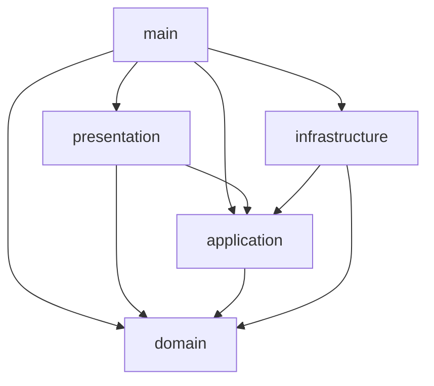
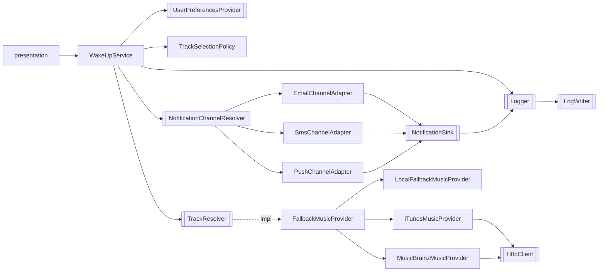
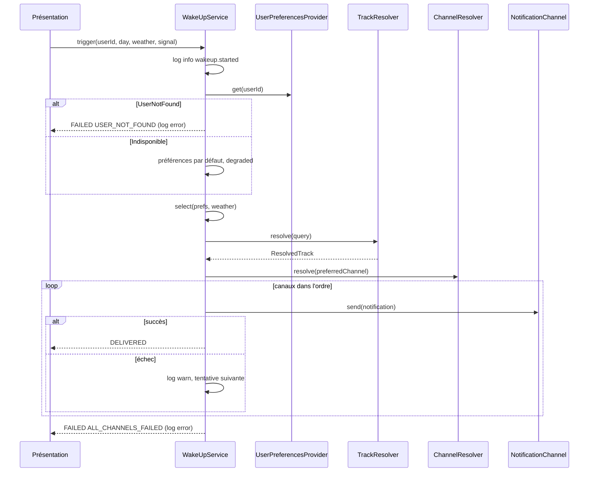

# STD — Spécifications techniques détaillées : Réveil musical

> Statut : validé par l'humain · Date : 2026-10-08
> Ce document est le **document d'architecture de `docs/`**. Il détaille le spine `_bmad-output/planning-artifacts/architecture/architecture-9-3-1-GDRM-TP-EXAMEN-2026-10-08/ARCHITECTURE-SPINE.md` (AD-1 à AD-14).
> Référentiel supérieur : `CLAUDE.md`. Besoin fonctionnel : `docs/SFD.md`.
> **[VALIDÉ]** marque une hypothèse de l'architecte validée par l'humain le 2026-10-08.

## 1. Vue d'ensemble

### 1.1 Paradigme

Architecture hexagonale (ports & adapters) en quatre couches, plus un composition root unique. Les interfaces (ports) sont définies par `domain`, l'`infrastructure` les implémente, `main` assemble.



| Source | Peut importer | Ne peut jamais importer |
| --- | --- | --- |
| `domain` | `domain` | tout le reste, `tsyringe`, `reflect-metadata`, packages tiers |
| `application` | `domain`, décorateurs `tsyringe` | `infrastructure`, `presentation`, `main` |
| `infrastructure` | `domain`, ports de `application`, décorateurs `tsyringe` | `presentation`, `main` |
| `presentation` | `application`, `domain` | `infrastructure` |
| `main` | tout | — |

### 1.2 Vue composants



### 1.3 Déploiement et environnement

Processus Node unique, sans base de données ni serveur imposé. Seuls flux sortants : HTTPS vers iTunes et MusicBrainz, via le port `HttpClient`. Aucune variable d'environnement n'est lue hors de `src/main/index.ts` (voir §8).

## 2. Structure du dépôt

```text
.
├── CLAUDE.md  README.md  sbom.cdx.json
├── package.json  package-lock.json  .npmrc  .nvmrc
├── tsconfig.json  tsconfig.build.json
├── eslint.config.js  .prettierrc  .dependency-cruiser.cjs  vitest.config.ts
├── docs/{SFD.md,STD.md,adr/,licenses.csv}
├── src/
│   ├── domain/{model,ports,errors}/
│   ├── application/
│   ├── infrastructure/{music/{itunes,musicbrainz,local},notifications/{email,sms,push},preferences,http,resilience,logging,config}/
│   ├── presentation/
│   └── main/{container.ts,index.ts}
└── tests/{unit,contract,architecture,integration,fixtures,fakes}/
```

Chaque module d'infrastructure expose uniquement son adapter par son `index.ts` ; les DTO restent non exportés. Un fichier = un type exporté principal.

## 3. Domaine

### 3.1 Modèle (immuable, sans décorateur)

```ts
type UserId = string & { readonly __brand: 'UserId' };
type WeatherType = 'SUNNY' | 'RAIN' | 'SNOW' | 'CLOUDY';
type DayOfWeek = 'MONDAY' | 'TUESDAY' | 'WEDNESDAY' | 'THURSDAY' | 'FRIDAY' | 'SATURDAY' | 'SUNDAY';
type ChannelKind = 'EMAIL' | 'SMS' | 'PUSH';

interface Track { readonly title: string; readonly artist: string }
interface TrackQuery { readonly title: string; readonly artist?: string }
interface UserPreferences {
  readonly trackByWeather: ReadonlyMap<WeatherType, TrackQuery>;
  readonly fallbackTrack: TrackQuery;
  readonly preferredChannel: ChannelKind;
}
interface WakeUpNotification { readonly recipient: UserId; readonly title: string; readonly body: string; readonly track: Track }
type TrackSource = 'WEATHER' | 'USER_FALLBACK' | 'LOCAL_FALLBACK';
interface ResolvedTrack { readonly track: Track; readonly providerName: string; readonly isLocalFallback: boolean }
interface ChannelAttempt { readonly channel: ChannelKind; readonly succeeded: boolean; readonly cause?: string }

type WakeUpResult =
  | { readonly status: 'DELIVERED'; readonly degraded: boolean; readonly track: Track; readonly trackSource: TrackSource;
      readonly providerName: string; readonly channel: ChannelKind; readonly attempts: readonly ChannelAttempt[] }
  | { readonly status: 'FAILED'; readonly degraded: true; readonly reason: 'USER_NOT_FOUND' | 'ALL_CHANNELS_FAILED' | 'CANCELLED';
      readonly track?: Track; readonly trackSource?: TrackSource; readonly providerName?: string; readonly attempts: readonly ChannelAttempt[] };
```

`UserId`, `WeatherType` et `DayOfWeek` sont créés par des fonctions de fabrique qui valident les invariants. Avec `exactOptionalPropertyTypes`, les champs optionnels sont omis plutôt qu'affectés à `undefined`.

### 3.2 Ports et tokens (`src/domain/ports/`)

| Port | Méthodes | Token |
| --- | --- | --- |
| `UserPreferencesProvider` | `get(userId, signal?) → Promise<UserPreferences>` ; lève `UserNotFoundError` ou `PreferencesUnavailableError` | `USER_PREFERENCES_PROVIDER` |
| `MusicProvider` | `readonly name: string` ; `find(query, signal?) → Promise<Track \| null>` | `MUSIC_PROVIDER` |
| `TrackResolver` **[VALIDÉ]** | `resolve(query, signal?) → Promise<ResolvedTrack>` (ne retourne jamais `null`) | `TRACK_RESOLVER` |
| `NotificationChannel` | `readonly kind: ChannelKind` ; `send(notification, signal?) → Promise<void>` ; lève `NotificationDeliveryError` | `NOTIFICATION_CHANNEL` (multi-valeur) |
| `NotificationChannelResolver` | `resolve(preferred) → readonly NotificationChannel[]` (préféré d'abord) | `NOTIFICATION_CHANNEL_RESOLVER` |
| `NotificationSink` **[VALIDÉ]** | `record(entry: SimulatedDelivery) → void` | `NOTIFICATION_SINK` |
| `Clock` | `now() → Date` | `CLOCK` |
| `Logger` | `info/warn/error(event: string, fields?: LogFields) → void` | `LOGGER` |
| `LogWriter` **[VALIDÉ]** | `write(line: string) → void` | `LOG_WRITER` |
| `HttpClient` | `getJson(url, { headers?, timeoutMs, signal? }) → Promise<HttpResponse>` ; `HttpResponse = { status: number; body: unknown }` | `HTTP_CLIENT` |

**Pourquoi `TrackResolver`.** Le port `MusicProvider` de `CLAUDE.md` retourne `Track | null`, ce qui perd la provenance exigée par le résultat (SFD §4.3). `FallbackMusicProvider` implémente donc `MusicProvider` (comme prévu) **et** `TrackResolver`. `WakeUpService` ne dépend que de `TrackResolver`.

Le port applicatif `WakeUpUseCase` est dans `application` :

```ts
interface WakeUpUseCase { trigger(userId: UserId, day: DayOfWeek, weather: WeatherType, signal?: AbortSignal): Promise<WakeUpResult> }
const WAKE_UP_USE_CASE = Symbol('WakeUpUseCase');
```

Le paramètre `signal` est ajouté à la signature indicative de `CLAUDE.md` pour propager l'annulation (§6.2).

### 3.3 Erreurs (`src/domain/errors/`)

Classes typées héritant de `DomainError` : `InvalidInputError`, `UserNotFoundError`, `PreferencesUnavailableError`, `MusicProviderUnavailableError`, `NotificationDeliveryError`. Jamais de `throw` d'une chaîne.

## 4. Application

### 4.1 `TrackSelectionPolicy` (pur)

```ts
select(prefs: UserPreferences, weather: WeatherType): { query: TrackQuery; source: 'WEATHER' | 'USER_FALLBACK' }
```

Retourne la requête de la météo si elle existe, sinon `fallbackTrack`. Sans I/O, testable sans fake.

### 4.2 `FallbackMusicProvider` (composite, Strategy)

Constructeur : liste ordonnée de `MusicProvider` (multi-valeur résolue dans `container.ts`) et `Logger`.

```text
resolve(query, signal):
  pour chaque provider dans l'ordre configuré:
    si signal.aborted -> propager l'annulation
    essayer provider.find(query, signal)
    si Track -> retourner ResolvedTrack{ providerName, isLocalFallback: provider est le dernier }
    si null ou MusicProviderUnavailableError -> log warn(event 'music.provider.skipped', { provider, cause }) et continuer
  (le dernier maillon, LocalFallback, ne peut pas échouer: le code ne sort jamais de la boucle sans résultat)
```

Un `catch` ne reste jamais vide : toute erreur est journalisée. Une erreur inattendue (non `MusicProviderUnavailableError`) est aussi journalisée puis traitée comme « indisponible », pour garantir la bascule.

### 4.3 `NotificationChannelResolver` (Factory injectée)

Construit dans `container.ts` avec la liste des `NotificationChannel` et `channelFallbackOrder` de la config. `resolve(preferred)` : le canal préféré d'abord, puis les autres dans l'ordre configuré, sans doublon. Un canal absent de la liste enregistrée est ignoré et journalisé.

### 4.4 `WakeUpService` (Facade)

Constructeur (5 paramètres maximum) : `USER_PREFERENCES_PROVIDER`, `TRACK_RESOLVER`, `NOTIFICATION_CHANNEL_RESOLVER`, `LOGGER`, `TRACK_SELECTION_POLICY`. La construction du message est une fonction pure du module applicatif `WakeUpMessage`.



Règles d'implémentation :
- `degraded = providerName ≠ premier de la chaîne ‖ canal effectif ≠ préféré ‖ préférences par défaut`.
- Si `signal.aborted` à une étape : retour `FAILED/CANCELLED`, log `warn`.
- Aucun `try` ne se termine sans retour d'un résultat ou sans journal.

## 5. Infrastructure

### 5.1 `HttpClient` (`infrastructure/http`)

Adapter sur le `fetch` global de Node, seul endroit autorisé à l'appeler. Applique `AbortSignal.any([signal, AbortSignal.timeout(timeoutMs)])`, lit le JSON, retourne `{ status, body }`. Toute erreur réseau est relancée comme `HttpTransportError` (technique, non exportée au-delà d'`infrastructure`). **[VALIDÉ]** : un retry maximum pour les erreurs de transport et les 5xx, jamais pour 4xx.

### 5.2 Adapter iTunes (`infrastructure/music/itunes`)

| Élément | Détail |
| --- | --- |
| URL | `ITUNES_CONFIG.baseUrl` + `URLSearchParams` : `term`, `media=music`, `limit=5` |
| DTO privé | `{ resultCount: number; results: { trackName: string; artistName: string; trackViewUrl?: string }[] }` |
| Garde de type | vérifie la forme avant tout mapping, sans `any` |
| Mapping | premier résultat dont `trackName` et `artistName` sont des chaînes non vides → `Track { title, artist }` ; `trackViewUrl` jamais lu au-delà du DTO |
| Cache | `TtlCache<Track \| null>`, clé = terme normalisé (minuscules, espaces compactés), TTL de la config |
| Quota | `RateLimiter` : si le quota est atteint, retourne `null` sans appel réseau |
| Circuit | `CircuitBreaker` : ouvert → `null` sans appel réseau |
| Erreurs | tout échec → `null` ou `MusicProviderUnavailableError` |

Ordre d'évaluation : cache → circuit → quota → appel → mise en cache du succès.

### 5.3 Adapter MusicBrainz (`infrastructure/music/musicbrainz`)

| Élément | Détail |
| --- | --- |
| URL | `MUSICBRAINZ_CONFIG.baseUrl` + `query`, `fmt=json` |
| En-tête | `User-Agent` = `MUSICBRAINZ_CONFIG.userAgent` (non vide, vérifié au chargement de la config), présent sur chaque requête |
| DTO privé | `{ recordings: { title: string; 'artist-credit'?: { name: string }[] }[] }` |
| Mapping | `title`, et `artist` = noms de `artist-credit` joints ; si absent ou vide, le résultat est écarté |
| Cadence | `RateLimiter` à ≈ 1 requête/s ; cache et circuit comme iTunes |

### 5.4 Fallback local (`infrastructure/music/local`)

`LocalFallbackMusicProvider` : liste figée de `Track` en mémoire, fournie par la config. `find` normalise le titre demandé, retourne l'entrée correspondante, sinon la première. Ne lit rien, ne peut pas échouer. La liste n'est pas vide (vérifié au chargement de la config).

### 5.5 Canaux (`infrastructure/notifications/{email,sms,push}`)

| Canal | Mock (non exporté) | Interface du mock | Conversion dans l'adapter |
| --- | --- | --- | --- |
| Email | `FakeEmailClient` | `sendMail(to, subject, html, highPriority): void` | `to = recipient`, `subject = title`, `html = <p>body</p>`, `highPriority = true` |
| SMS | `FakeSmsGateway` | `push(phoneNumber, text): Promise<boolean>` | `phoneNumber = recipient`, `text = body` ; `false` → `NotificationDeliveryError` |
| Push | `FakePushService` | `dispatch(payload: PushPayload): Promise<{ ok: boolean; id: string }>` | `payload = { deviceId: recipient, heading: title, message: body }` ; `ok=false` → `NotificationDeliveryError` |

Chaque mock reçoit `NotificationSink` et y inscrit une `SimulatedDelivery` ; il n'envoie rien. L'adapter attrape toute erreur du mock et la relance en `NotificationDeliveryError`, sans `catch` vide. Chaque adapter expose son `kind` (`EMAIL`, `SMS`, `PUSH`).

### 5.6 Préférences (`infrastructure/preferences`)

`InMemoryUserPreferencesProvider` (mock du service interne) : table `userId → UserPreferences` fournie par fixtures/config ; `UserNotFoundError` si absent. Il est accédé uniquement par le port.

### 5.7 Journal (`infrastructure/logging`)

- `JsonLogger` implémente `Logger` : écrit `JSON.stringify({ level, event, at, ...fields })` via `LogWriter`, avec `at` issu de `Clock`.
- `StdoutLogWriter` implémente `LogWriter` : `process.stdout.write(line + '\n')`. C'est la seule référence à `process.stdout` du code. **[VALIDÉ]**
- `LoggerNotificationSink` implémente `NotificationSink` : appelle `Logger.info('notification.simulated', { channel, recipient, title })`.
- Les tests remplacent `LogWriter` par un writer en mémoire.

### 5.8 Résilience (`infrastructure/resilience`)

Interfaces internes à l'infrastructure ; implémentations maison, sans dépendance ; temps lu via `Clock`.

| Composant | Rôle | Paramètres (valeurs initiales proposées, dans la config) |
| --- | --- | --- |
| `TtlCache<V>` | `get(key)`, `set(key, value)` ; expire à `ttlMs` | `ttlMs = 3 600 000` (iTunes), `86 400 000` (MusicBrainz) |
| `RateLimiter` | fenêtre glissante, `tryAcquire() → boolean` | iTunes `20 requêtes / 60 000 ms` ; MusicBrainz `1 requête / 1 000 ms` |
| `CircuitBreaker` | états `CLOSED`, `OPEN`, `HALF_OPEN` ; `canCall()`, `recordSuccess()`, `recordFailure()` | `failureThreshold = 3`, `halfOpenAfterMs = 30 000` |

Chaque fournisseur HTTP reçoit ses propres instances, créées par `useFactory`. **[VALIDÉ]** : valeurs numériques.

### 5.9 Configuration (`infrastructure/config`)

`loadConfig(env: Readonly<Record<string, string | undefined>>): AppConfig` est appelée une seule fois dans `src/main/index.ts` avec `process.env`. Elle valide à la main (types, bornes, `userAgent` non vide, liste locale non vide, ordre des fournisseurs et des canaux connus) et lève `ConfigError` au démarrage. Le résultat est immuable.

| Clé de config | Rôle | Valeur par défaut proposée |
| --- | --- | --- |
| `music.providerOrder` | ordre de la chaîne | `['itunes', 'musicbrainz', 'local']` |
| `music.itunes` | `baseUrl`, `timeoutMs`, `ttlMs`, quota | `https://itunes.apple.com/search`, 3000, 3 600 000, 20 / 60 s |
| `music.musicbrainz` | `baseUrl`, `userAgent`, `timeoutMs`, `ttlMs`, cadence | `https://musicbrainz.org/ws/2/recording`, `ReveilMusical/<version> ( <contact> )`, 3000, 86 400 000, 1 / 1 s |
| `music.localTracks` | liste de secours | au moins 3 morceaux |
| `breaker` | `failureThreshold`, `halfOpenAfterMs` | 3, 30 000 |
| `notifications.channelFallbackOrder` | ordre des canaux | `['EMAIL', 'SMS', 'PUSH']` |
| `notifications.sendTimeoutMs` | délai par tentative | 2000 |
| `defaults.preferences` | préférences si service indisponible | canal `EMAIL`, secours = première entrée locale |

Le contact du `User-Agent` est une valeur de configuration à fournir, jamais écrite dans la logique.

## 6. Présentation

`src/presentation` fournit un point d'entrée mince **[VALIDÉ]** :

```ts
handleWakeUp(raw: { userId: string; day: string; weather: string }, signal?: AbortSignal): Promise<WakeUpResult>
```

Elle valide et convertit (SFD §4.1), lève `InvalidInputError`, puis appelle `WakeUpUseCase`. Elle ne dépend que d'`application` et `domain`.

## 7. Composition root (`src/main`)

`index.ts` : `import 'reflect-metadata'` en première ligne, `loadConfig(process.env)`, construit le conteneur, résout `WAKE_UP_USE_CASE`. `container.ts` est le seul fichier qui appelle `register`, `resolve`, `resolveAll` ou `new` d'une implémentation.

| Token | Implémentation | Durée de vie |
| --- | --- | --- |
| `CLOCK` | `SystemClock` | Singleton |
| `LOG_WRITER` | `StdoutLogWriter` | Singleton |
| `LOGGER` | `JsonLogger` | Singleton |
| `NOTIFICATION_SINK` | `LoggerNotificationSink` | Singleton |
| `HTTP_CLIENT` | `FetchHttpClient` | Singleton |
| `ITUNES_CONFIG`, `MUSICBRAINZ_CONFIG`, … | objets de config | `useValue` |
| `MUSIC_PROVIDER` (multi-valeur) | `ITunesMusicProvider`, `MusicBrainzMusicProvider`, `LocalFallbackMusicProvider` (+ leur cache, limiteur, breaker) | Singleton, assemblés par `useFactory` |
| `TRACK_RESOLVER` | `FallbackMusicProvider` (providers dans l'ordre de config) | Transient (`useFactory`) |
| `NOTIFICATION_CHANNEL` (multi-valeur) | `EmailChannelAdapter`, `SmsChannelAdapter`, `PushChannelAdapter` | Transient |
| `NOTIFICATION_CHANNEL_RESOLVER` | resolver (`useFactory` avec `resolveAll`) | Transient |
| `USER_PREFERENCES_PROVIDER` | `InMemoryUserPreferencesProvider` | Singleton |
| `TRACK_SELECTION_POLICY` | `TrackSelectionPolicy` | Transient |
| `WAKE_UP_USE_CASE` | `WakeUpService` | Transient |

Règle de captivité : un Singleton ne dépend que de Singletons. Ajouter un fournisseur ou un canal = un adapter, une entrée dans `ChannelKind` si besoin, et un enregistrement ici.

## 8. Gestion des dépendances implicites

| Dépendance implicite | Traitement |
| --- | --- |
| `process.env` | lu une seule fois dans `index.ts`, passé à `loadConfig` |
| `Date` / `Date.now()` | uniquement dans `SystemClock` (port `Clock`) |
| `fetch` | uniquement dans `FetchHttpClient` |
| `console.*` | interdit (règle ESLint) ; sortie via `LogWriter` |
| `process.stdout` | uniquement dans `StdoutLogWriter` |
| `Math.random()` | interdit ; fallback local déterministe |
| `setTimeout` / timeouts | `AbortSignal.timeout` avec valeur de config |
| `fs` | non utilisé |
| Singletons de module | interdits ; durées de vie dans `container.ts` |

## 9. Outillage et configuration

| Fichier | Contenu requis |
| --- | --- |
| `tsconfig.json` | `strict`, `noUncheckedIndexedAccess`, `exactOptionalPropertyTypes`, `noImplicitOverride`, `experimentalDecorators: true`, `module: NodeNext`, `target` ES2023 ou plus récent, supporté par Node 24 |
| `.npmrc` | `save-exact=true`, `ignore-scripts=true` |
| `.nvmrc` / `engines` | `24` / `>=24 <25` |
| ESLint | `typescript-eslint` strict, `no-floating-promises`, `no-restricted-syntax` (interdit `new` d'une classe d'infrastructure dans `application`/`domain`), `no-console`, `--max-warnings 0` |
| `.dependency-cruiser.cjs` | règles de couches (§1.1), aucun cycle, `tsyringe` limité à `application`/`infrastructure`/`main` |
| `vitest.config.ts` | setup `reflect-metadata` + blocage de `fetch` ; seuils : `domain`+`application` ≥ 90 % lignes / 85 % branches ; `infrastructure` ≥ 85 % / 75 % ; global ≥ 85 % / 80 % |
| Scripts npm | ceux de `CLAUDE.md` §5.1 ; `verify` enchaîne la Definition of Done |

## 10. Stratégie de test

| Niveau | Contenu | Seams utilisés |
| --- | --- | --- |
| Unitaire `application` | `WakeUpService` (4 météos, météo non couverte, pannes fournisseur et canal, annulation, anti-silence exhaustif sur toutes les combinaisons de pannes, utilisateur inconnu, préférences vides) ; `TrackSelectionPolicy` ; `FallbackMusicProvider` ; resolver de canaux | `tests/fakes/` : `FakeUserPreferencesProvider`, `FakeMusicProvider`, `FakeNotificationChannel`, `FakeClock`, `InMemoryLogger`, `FakeHttpClient` |
| Résilience | `TtlCache`, `RateLimiter`, `CircuitBreaker` avec `vi.useFakeTimers` ou `FakeClock` | `FakeClock` |
| Contrat | `musicProviderContract(factory)` joué sur iTunes, MusicBrainz, Local ; `notificationChannelContract(factory)` joué sur les 3 canaux | fixtures JSON dans `tests/fixtures/` (dont `trackViewUrl`) |
| Architecture | couches, cycles, `tsyringe` et `container` limités, non-fuite de DTO (clés exactes `title`/`artist`, `trackViewUrl`/`artist-credit` absents hors `infrastructure/music/**`), absence de `new <Infra>` dans `application`/`domain`, résolution complète du conteneur, absence de dépendance captive | analyse statique + conteneur réel |
| Intégration | conteneur réel avec `HttpClient` remplacé : `trigger` pour chaque canal, bascule iTunes → MusicBrainz → Local | `FakeHttpClient` |

`fetch` global est remplacé en setup par un stub qui lève une erreur à tout appel non prévu. Les tests ne modifient jamais le conteneur global : child container ou `clearInstances()`.

## 11. Gouvernance des dépendances

Versions relevées avec `npm view` le 2026-10-08 ; elles sont revérifiées par `npm ls` et `npm outdated` à l'installation et copiées telles quelles dans le README.

| Package | Rôle | Version retenue | Licence (npm) | Remarque |
| --- | --- | --- | --- | --- |
| typescript | langage | 6.0.3 | Apache-2.0 | **Pas la 7.0.2** (dernière) : `typescript-eslint` 8.71.1 exige `typescript <6.1.0` |
| tsyringe | IoC | 4.10.0 | MIT | Dernière release 2025-04-16, soit plus de 12 mois : justification README requise ; dépend de `tslib` 1.x (0BSD) |
| reflect-metadata | polyfill requis par tsyringe | 0.2.2 | Apache-2.0 | Dernière release 2024-03 |
| vitest, @vitest/coverage-v8 | tests, couverture | 5.0.3 | MIT | Voir risque R-1 |
| eslint | lint | 10.12.0 | MIT | |
| typescript-eslint | lint TS | 8.71.1 | MIT | |
| prettier | format | 3.9.9 | MIT | |
| dependency-cruiser | règles de couches | 18.5.0 | MIT | |
| license-checker-rseidelsohn | audit licences | 5.0.1 | BSD-3-Clause | |
| @cyclonedx/cyclonedx-npm | SBOM | 6.0.1 | Apache-2.0 | |
| tsx | exécution en dev | 4.23.15 | MIT | à valider (§0.4 de `CLAUDE.md`) |
| @types/node | types Node | 24.19.1 | MIT | aligné sur Node 24 |

`cockatiel` (MIT, 4.0.0) existe mais n'est pas retenu : le circuit breaker maison suffit. Licences et transitives sont reconfirmées par `license-checker-rseidelsohn --production --onlyAllow …` (voir `CLAUDE.md` §4.3).

Écart d'environnement : Node installé sur ce poste = 22.21.0, alors que le LTS actif est 24.x. Installer Node 24 avant le scaffolding (`nvm use`).

## 12. Risques techniques

| ID | Risque | Mitigation |
| --- | --- | --- |
| R-1 | Vitest 5 repose sur Vite 8 : le support de `experimentalDecorators` avec décorateurs de paramètres (`@inject`) n'est pas vérifié | Spike de 30 minutes en première story ; repli : `useFactory` sans décorateurs (ADR + accord humain) |
| R-2 | `tsyringe` peu actif (dernière release > 12 mois) | Justification README ; isolation par le port, remplaçable par une autre implémentation de conteneur |
| R-3 | Limites de débit iTunes / MusicBrainz | Cache, limiteur, circuit breaker, fallback local |
| R-4 | Compatibilité TypeScript 6 / `typescript-eslint` | Versions épinglées ensemble ; vérifier `npm ls` |
| R-5 | Écart Node local (22) / cible (24) | Installer Node 24 ; `engines` bloque le reste |

## 13. Plan de réalisation (stories suggérées)

Chaque story suit le cycle de `CLAUDE.md` §5.2 (TDD, DoD verte, statut BMAD).

| # | Story | Contenu |
| --- | --- | --- |
| S1 | Socle | `package.json`, `.npmrc`, tsconfig, ESLint, Prettier, Vitest (avec spike R-1), dependency-cruiser, scripts, setup de test |
| S2 | Domaine | modèles, fabriques, erreurs, ports et tokens |
| S3 | Application | `TrackSelectionPolicy`, `WakeUpMessage`, `FallbackMusicProvider`, resolver de canaux, `WakeUpService` + fakes |
| S4 | Résilience et journal | `TtlCache`, `RateLimiter`, `CircuitBreaker`, `SystemClock`, `JsonLogger`, `StdoutLogWriter`, sink |
| S5 | Musique | `FetchHttpClient`, iTunes, MusicBrainz, Local + tests de contrat et fixtures |
| S6 | Canaux et préférences | 3 mocks + adapters + préférences mockées + tests de contrat |
| S7 | Config, présentation, composition root | `loadConfig`, `handleWakeUp`, `container.ts`, `index.ts` |
| S8 | Qualité et conformité | tests d'architecture et d'intégration, couverture, audit, `docs/licenses.csv`, SBOM, README |

## 14. Décisions validées par l'humain

1. Nouveaux ports par rapport à la liste minimale de `CLAUDE.md` : `TrackResolver`, `NotificationSink`, `LogWriter` (§3.2).
2. Paramètre `signal` ajouté à `trigger` (§3.2).
3. Sortie du journal : `process.stdout.write` encapsulé dans `StdoutLogWriter` (§5.7).
4. Repli des canaux, préférences par défaut, destinataire des mocks (voir SFD §13).
5. Valeurs numériques de résilience (§5.8) et retry de `HttpClient` (§5.1).
6. Présentation sans serveur HTTP (§6).
7. `STD.md` tient lieu de `docs/architecture.md` cité dans `CLAUDE.md` §1.2 : mettre `CLAUDE.md` à jour ou renommer.
8. Épinglage de TypeScript 6.0.3 et Node 24 (§11).
